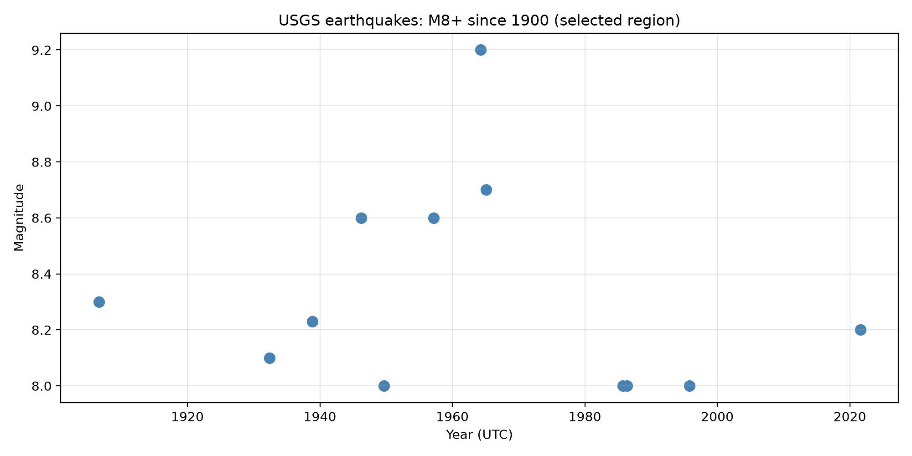

# The phenomenon--earthquakes
Data source: [USGS Earthquake Catalog — CSV download](https://earthquake.usgs.gov/fdsnws/event/1/query?format=csv&starttime=1900-01-01&minlatitude=18.01&maxlatitude=72.299&minlongitude=-195.645&maxlongitude=-66.973&minmagnitude=8&orderby=time)



## The phenomenon
I looked at how the magnitudes of earthquakes of magnitude 8 and above varied over time within my selected geographic region. The 12 recorded events have different magnitudes and occur at uneven intervals. I chose this topic because I wanted to compare these large earthquakes and see when the strongest event in the dataset occurred. This small, filtered dataset describes the selected events, but it does not show whether earthquakes worldwide are becoming stronger or more frequent.

## The source

This project explores the timing and magnitudes of large earthquakes within a selected geographic region. The data comes from the USGS Earthquake Catalog API.

The downloaded CSV contains 12 earthquake records, excluding the header. Each row represents one earthquake with a magnitude of at least 8, occurring from 1900 onward within the selected search bounds. These bounds cover latitudes from 18.01 to 72.299 degrees and longitudes from -195.645 to -66.973 degrees, crossing the international date line.

The file includes event times, coordinates, depths, magnitudes, and location descriptions. Times are recorded in UTC, coordinates are in degrees, and depths are in kilometres. Magnitude is a logarithmic measure without a physical unit. The original downloaded file is saved locally so the plot can be reproduced using the same records.

## What the picture shows

The scatter plot places earthquake dates on the horizontal axis and magnitudes on the vertical axis, with each point representing one event. The largest magnitude in this saved dataset is 9.2, recorded in 1964. The plot omits depth, location, and measurement uncertainty; because the search also excludes smaller earthquakes and events outside the selected region, it cannot establish a global trend in earthquake frequency.


## Run it

```
uv run fetch.py
uv run plot.py
```
